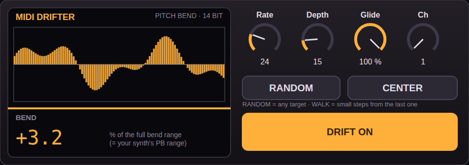

# MIDI DRIFTER — slow random pitch-bend drift (Max for Live MIDI effect)

*Mock-up of the UI from the same layout data; Max draws the real thing. The scope curve in the picture is illustrative.*

Put it on a MIDI track in front of a synth. Notes and everything else pass through untouched; the device adds a slowly
wandering pitch bend (14 bit) to the track. Successor of the owner's "Midi Drifter 0.9" (`original/`).

**Status: built, wiring-tested, NOT tested in Live. Nobody has heard it yet.**

## Controls
| control | what | default |
|---|---|---|
| **RATE** 0–100 | how often a new target is picked: 4 s (0) … 40 ms (100), exponential | 24 (≈ 1.3 s) |
| **DEPTH** 0–100 | size of the bend, **squared taper**: bend = (DEPTH/100)² of the *full* bend range, so the low end is very fine (15 → 2.25 %, 30 → 9 %, 50 → 25 %, 100 → full). Real pitch depends on your synth's PB range. | 15 (≈ 2 %) |
| **GLIDE** 0–100 % | ramp time as share of the interval. 100 % = continuous drift, 0 % = steps | 100 % |
| **CH** 1–16 | MIDI channel of the bend messages | 1 |
| **RANDOM / WALK** | RANDOM: any target in ±100 %. WALK: small steps (≤ 35 %) from the last target | RANDOM |
| **CENTER** | glide back to centre (150 ms) and forget the walk position | – |
| **DRIFT ON/OFF** | start/stop; switching off glides back to centre | ON |

Everything is a Live parameter: automatable, saved with the set. The glass shows the drift of the last ≈ 5 s (normalised, so it
moves even at low depth) and the current bend in % of the full range.

## What changed against 0.9 (see `original/`)
- 0.9 had no depth control (fixed ≈ ±10 %; my first build kept 10 % as linear default and was too strong in Live, so DEPTH is now a squared dial, default ≈ 2 %), no channel, nothing saved, and a bare UI with unlabelled dials.
- 0.9 sent 7-bit bend (`bendout`, 0–127; the range of 57…70 gave ≈ 14 steps). Now **14 bit** as raw bytes
  (`E0+ch-1, LSB, MSB`, centre 8192) through `midiout`, like micro.step.
- 0.9 ran `line` with a 1 ms grain and no filter (up to ~1000 messages/s while gliding). Now 10 ms grain and a `change`
  filter, so a message goes out only when the 14-bit value actually changes.
- New: WALK mode, GLIDE, RATE as a musical curve, CENTER, scope, read-out.
- Kept: idea and defaults (≈ 1.3 s per target, full-interval glide, starts on at load, returns to centre when switched off).

## Known limits (by design, not bugs)
- An incoming pitch bend (wheel, clip) passes through unchanged and is **not added** to the drift; both go to the synth.
- Switching the channel does not reset the old channel; press CENTER first.
- The drift is bend, so the instrument's pitch-bend range decides how far it sounds. Set it on the synth.

## Files
- `build_drifter.py` – generates everything (edit there, not in the outputs).
- `midi-drifter.amxd` – the device. `midi-drifter.maxpat` – patcher JSON (open in Max, or inspect).
- `test_patch.py` – runs the real patcher JSON in a small simulator of the Max objects it uses and checks the bytes that reach `[midiout]`:
  14-bit triplets (status, LSB, MSB), depth 0 = centre only, rate mapping, glide 0 vs 100, WALK step limit, channel, CENTER, on/off,
  scope/read-out, and that results do not depend on the order of fan-out connections. It proves the wiring, not Max's behaviour
  (it caught one real wiring bug while building: a bend value reaching the status-byte store).
- `triage/Drifter_thru.amxd` – only `midiin → midiout`: notes must still play.
  `triage/Drifter_send_test.amxd` – click the box: sends raw pitch bend +50 % (`224 0 96`) on channel 1 → checks that raw bytes reach your synth.
- `original/` – the owner's 0.9 (`driftert_0.9.amxd`, `Midi_Drifter_0.9.adv`), byte-identical to the upload
  (sha256 `af1743ef…106c23` and `40f1a46b…1c0cc6`). The `.adv` is only a preset that points at the `.amxd`.

## Untested — please check in Live
1. Device loads, UI looks like the mock-up (the scope is a `multislider`, the read-out a `flonum`; I could not verify their look in Max).
2. Drift is audible at the default DEPTH 15 (≈ 2 % of the bend range) with a synth whose PB range is, say, ±2 semitones (expect ≈ ±0.04 semitone).
3. Scope moves; RATE/DEPTH/GLIDE react live; WALK sounds different from RANDOM.
4. Raw bytes via `midiout` reach the synth (otherwise try `triage/Drifter_send_test.amxd`).
5. First tick after load, CENTER and switching off return cleanly to centre.

## If something doesn't work
1. `triage/Drifter_thru.amxd`: do notes pass? No → device plumbing. 2. `triage/Drifter_send_test.amxd`: does the pitch bend jump up?
No → `midiout` raw bytes / routing (check the track's MIDI To). 3. Full device; Max Console (Window → Max Console) shows errors.
