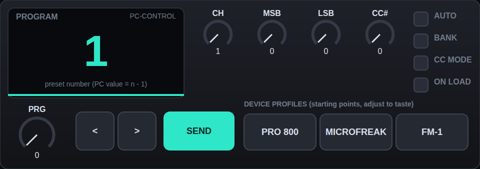

# PC·CONTROL — program change / bank select for Ableton (Max for Live MIDI effect)

*Mock-up of the UI from the same layout data; Max draws the real thing.*

Put it on a MIDI track in front of your external instrument (or an External Instrument device). Notes and everything else
pass through untouched; the device adds bank select and program change.

## What it does (v1)
- **Program** dial, **< >** buttons (wrap 0↔127), big display showing the preset number (PC value = number − 1).
- **Channel** 1–16, **Bank MSB / LSB** (CC 0 / CC 32), sent *before* the program, in that order.
- **BANK** toggle: send bank select or not. **CC MODE** toggle: send the program as `CC #n` instead of a Program Change
  (for synths that select programs by CC).
- **AUTO**: send as soon as a value changes. **ON LOAD**: send when the set/device loads (hardware forgets its patch).
  **SEND** sends on demand.
- **Device profile pads** (PRO 800, MICROFREAK, FM-1) set channel / bank / CC mode as **starting points only**:
  I could not verify the exact bank-select or program-change behaviour of these devices, so check them on the hardware and
  adjust (all settings are saved with the Live set).

## Not in v1 (next steps once v1 runs in Live)
Patch names per slot, loadable device profiles from a text file (so further devices can be added later), per-clip patch
recall, rig snapshots (several targets at once), two-way sync from incoming program changes.

## Files
- `build_pc.py` – generates everything (edit there, not in the outputs).
- `PCCONTROL.amxd` – the device. `PCCONTROL.maxpat` – patcher JSON.
- `test_patch.py` – runs the real patcher JSON in a small simulator of the Max objects it uses and checks the bytes that reach
  `[midiout]` (bank MSB, bank LSB, then PC/CC; channel status bytes; wrap-around; auto / on-load; fan-out order independence).
  It proves the wiring, not Max's behaviour.
- `triage/PC_thru.amxd` – only `midiin → midiout`: notes must still play.
  `triage/PC_send_test.amxd` – click the box: sends raw `192 5` (Program Change 6, channel 1) → checks that raw bytes reach your synth.

## If something doesn't work
1. `triage/PC_thru.amxd`: do notes pass? No → device plumbing. 2. `triage/PC_send_test.amxd`: does the synth change program? No →
   `midiout` raw bytes / routing (check the track's MIDI To). 3. Full device. Max Console (Window → Max Console) shows errors.
