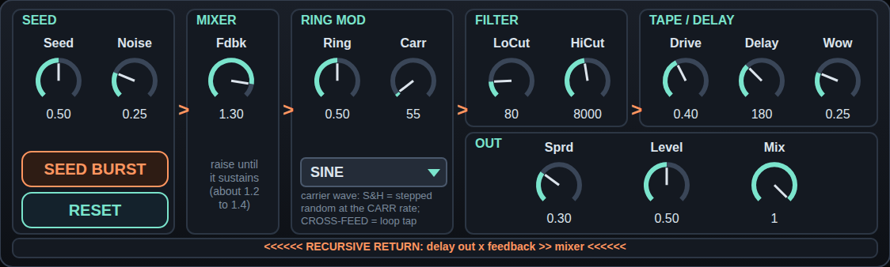

# VINK·LOOP — recursive feedback network (Max for Live audio effect)



*Mock-up of the UI from the same layout data; Max draws the real thing, so details differ slightly.*

A closed loop in which ring modulator, filters, tape saturation and a delay feed each other, so the sound keeps modulating
itself. Put it on an audio track (or an empty one: it makes sound by itself once the loop holds).

**Status: built, DSP tested in a JS transpile, NOT tested in Max or Live. Nobody has heard it yet.**

**Basis:** the structure follows `jaap_vink_recursive_sound_technique.md`, a description the owner supplied. It was **not**
checked against the video or against Jaap Vink's own work, so "after Vink" means "after that description".

## Structure
```
 seed in / noise burst / noise floor --> MIXER --> RING MOD --> HP + LP --> TAPE SATURATION --> DELAY --+--> out
                       ^                              ^ carrier: sine OR cross-feed (2nd delay tap)    |
                       +----------------------------- x FEEDBACK <------------------------------------+
```
Per channel; stereo = two independent loops, **SPREAD** detunes the right one (delay ×1.07, carrier ×1.013 at 100 %).
The delay is read before it is written (min 20 ms), so there is no one-sample feedback.

## Controls
| control | what | range / default |
|---|---|---|
| **SEED** | how much of the track audio goes into the loop | 0–1 / 0.5 |
| **NOISE** | noise floor in the loop (self-start; 0.25 ≈ −54 dB) | 0–1 / 0.25 |
| **SEED BURST** | button: ~120 ms noise burst into the loop | – |
| **FDBK** | loop gain before the ring-mod/filter losses. **The loop holds from about 1.2–1.3** (measured, see below) | 0–1.5 / 1.3 |
| **RING** | ring-modulator depth (0 = bypass, 1 = pure multiplication; power-normalised) | 0–1 / 0.5 |
| **CARR** | carrier oscillator, Hz | 0.5–2000 / 55 |
| **CROSS-FEED** | carrier = a second tap of the delay line instead of the oscillator (RING is capped at 0.85 in this mode) | off |
| **LOCUT / HICUT** | 2-pole high-pass / low-pass inside the loop | 80 Hz / 8 kHz |
| **DRIVE** | tape saturation `tanh(drive·x)/drive`, drive 1…6 | 0.4 |
| **DELAY** | loop delay, ms | 20–500 / 180 |
| **WOW** | wow/flutter/drift on the delay time (±2 % at 100 %) | 0.25 |
| **SPRD** | stereo spread (see above) | 0.3 |
| **LEVEL / MIX** | output level (peak ≤ level) and dry/wet | 0.5 / 100 % |

Everything is a Live parameter (automatable, saved with the set).

## What was measured (`node test_vink.js`, a 1:1 JS transpile of the GenExpr; not Max)
- Delay: an impulse reappears at the set time (180.0 ms). Mix 0 returns the dry signal exactly.
- **Ring mod works as described:** a 1 kHz seed through a 100 Hz carrier gives 900 and 1100 Hz and no 1000 Hz; with feedback,
  second-generation sidebands (800/1200 Hz) appear.
- **Gain behaviour:** with ring 0.5 / 55 Hz carrier / 80 Hz–8 kHz filters, FDBK 0.8 decays (> 100 dB in 8 s), 1.0 still decays,
  **1.25 and up holds**; at 1.4 the level settles (−8 → −7.5 dB rms) and stays ≤ level. The reason: the ring modulator spreads
  energy into sidebands that run into the filter stop bands, so the net gain is lower than FDBK. Deep ring, low carrier and narrow
  filters need more FDBK; wide filters need less. So the *metastable* point is not at 1.0 here; raise FDBK until it just holds.
- **Safety:** worst case (FDBK 1.5, ring 1, drive 1, loud noise input, wow 1, both carrier modes): finite, peak ≤ 0 dBFS. The tape stage
  limits the loop to 1/drive and the output tap is scaled to ≤ LEVEL.
- Cross-feed needs some signal to start (the ring modulator leaks 15 % of the input like an unbalanced one) and holds from FDBK ≈ 1.2.
- Left and right loops are independent; parameters that were never set (all zero) give no NaN.

## Files
- `build_vink.py` – generates everything (edit there, not in the outputs).
- `VINK.genexpr` – the DSP (paste into any gen~ codebox). `VINK.maxpat`, `VINK.amxd` – the device (same gen~ + `prepend <param>` structure as AGE·12).
- `test_vink.js` – the checks above, plus two lints for gen~ pitfalls found the hard way: ASCII only, and no variable first set inside an `if` block but used outside (the first build failed on exactly that: `car`). Cannot catch other GenExpr syntax errors (only Max can). `build_vink.py` runs the same two lints and refuses to build if they fail.
- `VINK_thru.amxd` – gen~ without code, in → out: must sound unchanged (device plumbing).
  `VINK_min.amxd` – the code without controls (defaults pushed by `loadbang`, dry/wet 50 %, a noise burst 0.4 s after load, FDBK 1.3): the dry half is audible at once, the wet half should start to drone.

## Untested — please check in Live
1. The device loads and looks like the mock-up; the dials move the sound.
2. SEED BURST on an empty track starts a drone at the default FDBK 1.3; lowering FDBK makes it die away, raising it to 1.5 stays bounded.
3. CROSS-FEED sounds different from the oscillator carrier; WOW makes the delay wander.
4. Level: default output should never be louder than −6 dBFS; check anyway with a quiet monitor first.

## If something doesn't work
Same ladder as AGE·12: 1. `VINK_thru.amxd` (silent → plumbing). 2. `VINK_min.amxd` (silent → the codebox does not compile: double-click `gen~`,
read **Window → Max Console**; the GenExpr is generated, so send me the message). 3. `VINK.amxd`.
